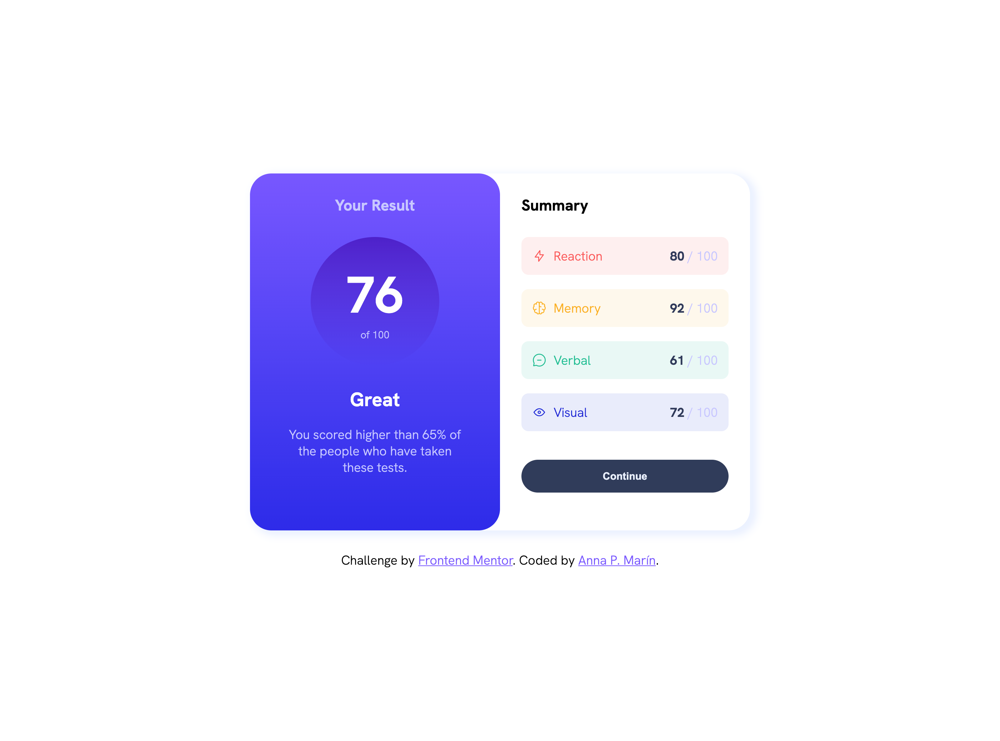

# Frontend Mentor - Results summary component solution

This is a solution to the [Results summary component challenge on Frontend Mentor](https://www.frontendmentor.io/challenges/results-summary-component-CE_K6s0maV). Frontend Mentor challenges help you improve your coding skills by building realistic projects. 

## Table of contents

- [Overview](#overview)
  - [The challenge](#the-challenge)
  - [Screenshot](#screenshot)
  - [Links](#links)
- [My process](#my-process)
  - [Built with](#built-with)
  - [What I learned](#what-i-learned)
  - [Useful resources](#useful-resources)
- [Acknowledgments](#acknowledgments)

## Overview

### The challenge

Users should be able to:

- View the optimal layout for the interface depending on their device's screen size
- See hover and focus states for all interactive elements on the page

### Screenshot

### Links

- [Solution URL](https://your-solution-url.com)
- [Live Site URL](https://your-live-site-url.com)

## My process

### Built with

- Semantic HTML5 markup
- SASS
- JavaScript (vanilla)

### What I learned

I learned some new JavaScript functionalities as "fetch" method to insert the json file data. Also, I learned to build an animated JS counter and finally I added a refresh functionality when the button is clicked.

### Useful resources

- [Animated Counter Video-Tutorial](https://www.youtube.com/watch?v=Cj2s_oHJJ4E) - This video-tutorial helped me building my counter.

## Acknowledgments

I'd like to thank Joel Ventura's counter video-tutorial. 
